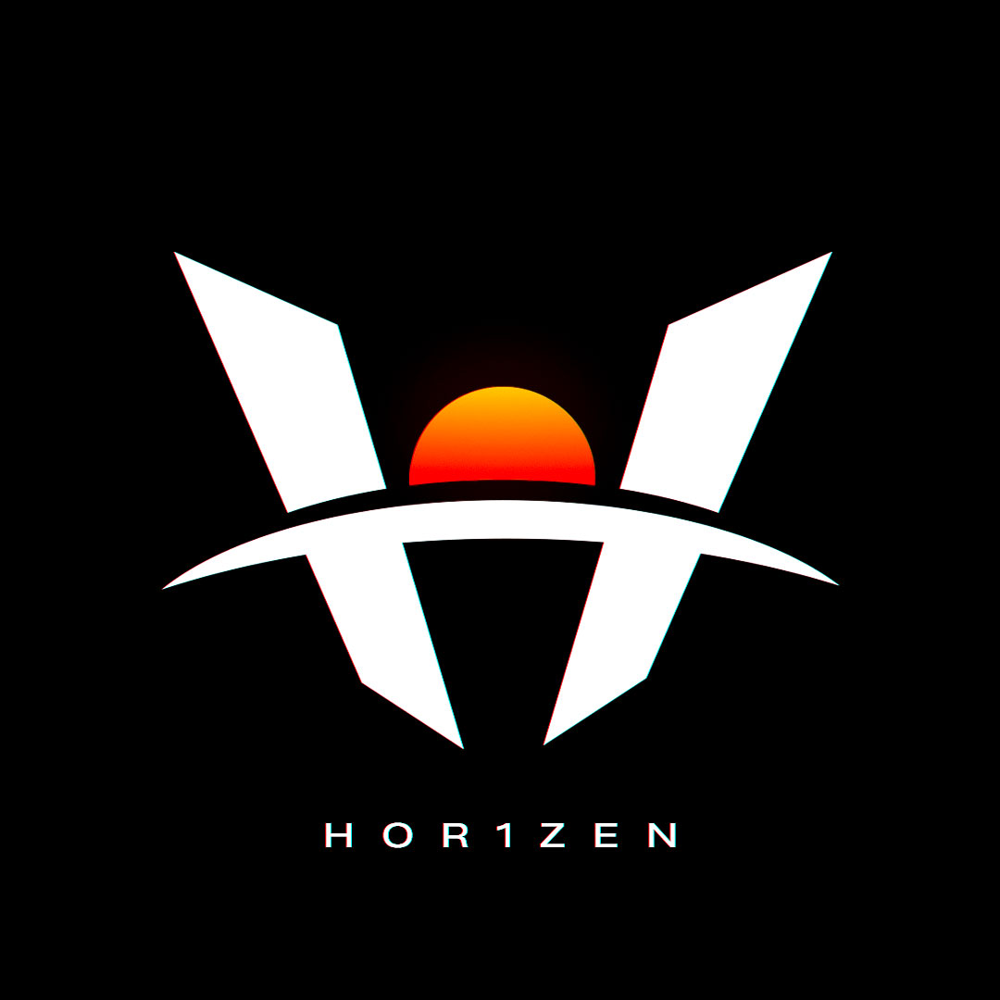
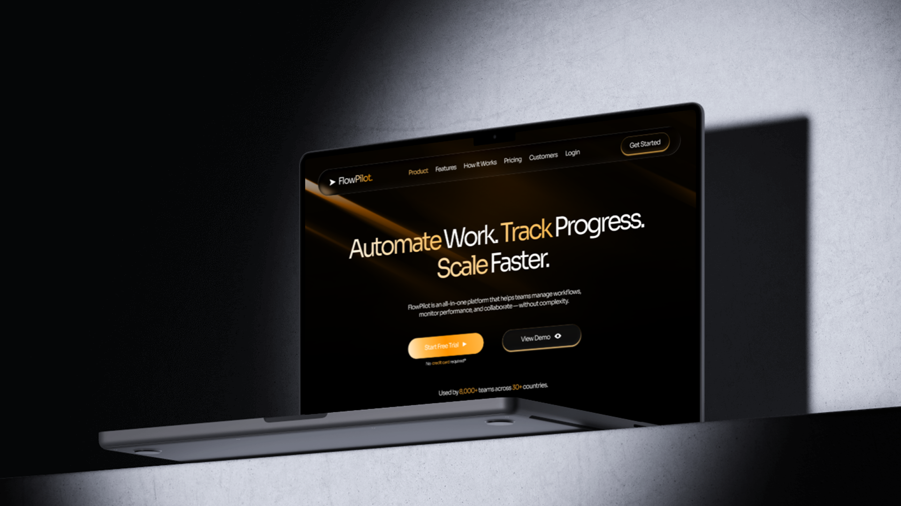
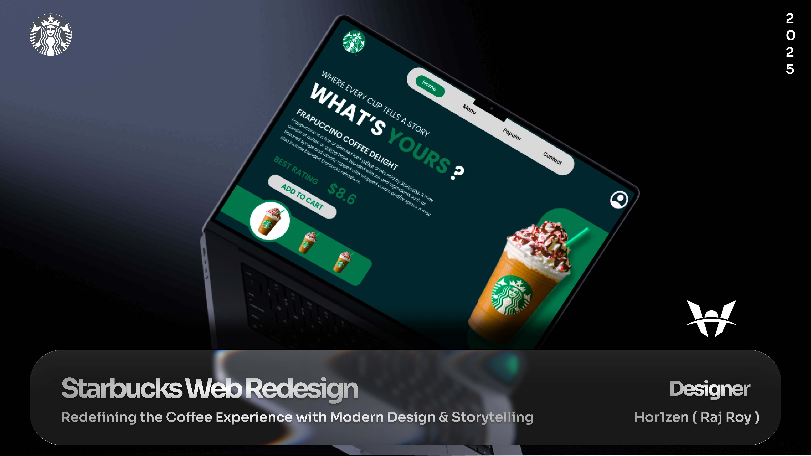

# 🌌 Hor1zen — Design Folio

  

<h3 align="center">Raj Roy | Graphics & UX Designer | CSE Student</h3>

  <a href="https://hor1zen.site"><strong>Explore the Live Site 🚀</strong></a>

  
  
  

---

## 🎨 About the Project

**Hor1zen.site** is a digital manifestation of my journey as a designer and developer. Built to showcase my dual expertise in **creative aesthetics** and **technical implementation**, this site serves as a window into my world for clients, collaborators, and fellow designers.

As a **BTech CSE Student** and a **Graphic/UX Designer**, I bridge the gap between "how it looks" and "how it works." This project was born from a need to house my diverse works — from Italian luxury branding to high-octane esports tournament graphics — in a single, premium experience.

---

## 🚀 Featured Projects

<table align="center">
  <tr>
    <td align="center"> <b>FlowPilot SaaS</b></td>
    <td align="center"> <b>Starbucks Redesign</b></td>
  </tr>
  <tr>
    <td align="center"> <b>Rosso Corallo</b></td>
    <td align="center"> <b>Strike Esports</b></td>
  </tr>
</table>

---

## 🤝 Trusted By

  
  
  
  
  

---

## ✨ Key Features

### 🤖 Intelligent Assistant (AI-Powered Chat)
The hallmark of this project is the **Hor1zen Assistant**. Unlike static portfolios, this site features a custom-built chat widget with a comprehensive **Knowledge Base**.
- **Context-Aware Responses:** Ask about my projects, skills, pricing, or background.
- **Quick-Reply Chips:** Intuitive navigation through conversational shortcuts.
- **Interactive Experience:** Smooth, human-like typing animations and real-time feedback.

### 📂 Filterable Design Portfolio
A streamlined showcase of my best work across multiple disciplines:
- **UX Design:** SAAS platforms and conceptual redesigns.
- **Esports Graphics:** Branding for major tournaments (ESM, ESFI, Solace).
- **Brand Identity:** Complete visual systems for global clients.
- **Social Media:** High-impact assets for products like *Comet* and *LetsShave*.

### ⏳ Interactive Journey Timeline
A vertical walkthrough of my evolution, detailing:
- **Education:** BTech in CSE at Marwadi University (2022-2026).
- **Milestones:** A year-by-year breakdown of key projects and freelance collaborations.

### 📱 Premium Glassmorphism UI
- **Modern Aesthetic:** Translucent layers, vibrant gradients, and crisp typography.
- **Fully Responsive:** Optimized for everything from mobile screens to ultra-wide monitors.
- **Micro-interactions:** Hover effects and transitions that respond to user intent.

---

## 🛠️ Built With

- **HTML5:** Semantic structure for optimal SEO.
- **CSS3:** Custom glassmorphic styles and responsive layouts.
- **JavaScript:** Pure Vanilla JS powering the chat engine and portfolio logic.
- **Ionicons:** Sharp, premium iconography.

---

## 🗺️ Project Walkthrough

1.  **Identity Sidebar:** Your gateway to my contacts and social presence.
2.  **Service Hub:** A showcase of what I do—from Web Design to App UX.
3.  **The Lab (Projects):** Use the filter system to dive into specific design categories.
4.  **Timeline:** Trace my growth from a student to a professional designer.
5.  **Direct Contact:** Map integration and a functional lead-capture form.
6.  **Hor1zen Bot:** Your personal guide available 24/7 on the bottom right.

---

## 📬 Connect with Me

- **Behance:** [behance.net/hor1zen](https://www.behance.net/hor1zen)
- **WhatsApp:** [Let's Chat!](https://wa.me/918866028563)
- **Email:** [hor1zen.dzns@gmail.com](mailto:hor1zen.dzns@gmail.com)

---

Crafted with passion by <b>Raj Roy (Hor1zen)</b>

